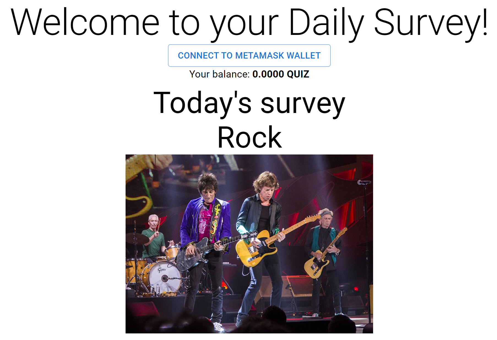
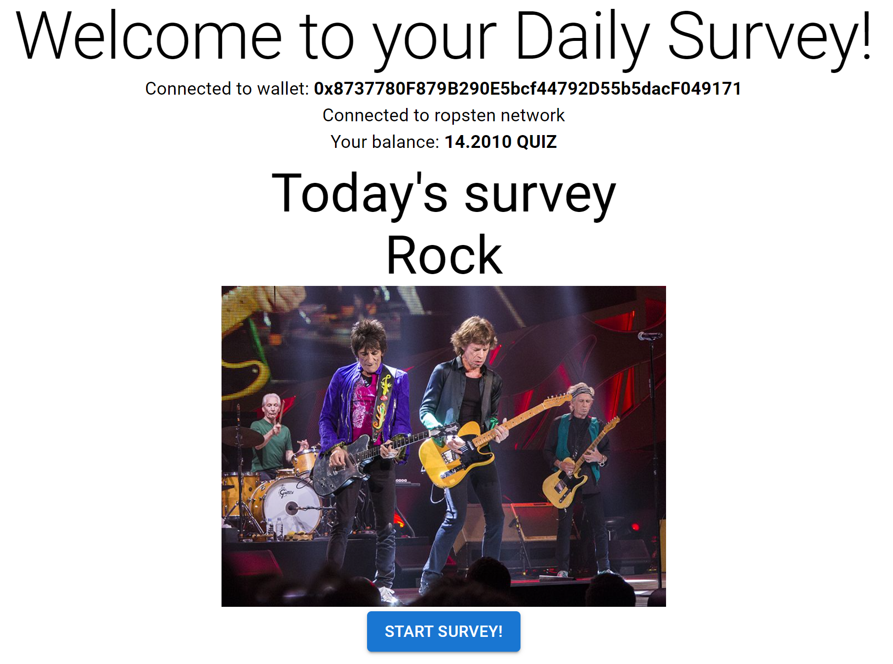
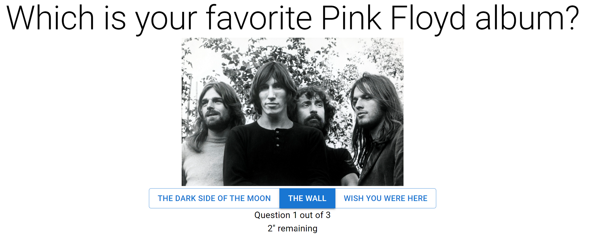
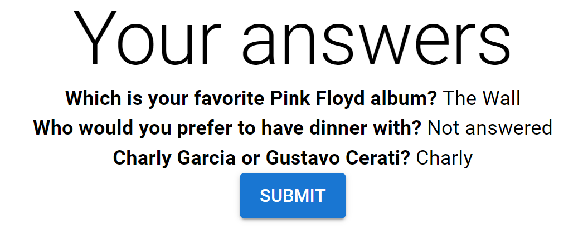
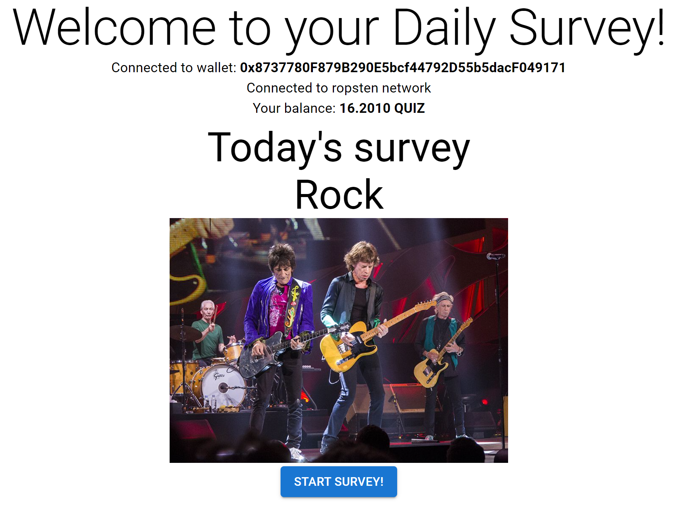

# crypto-quiz-challenge
Survey web app with $QUIZ (ERC20 token) reward on Ropsten Testnet.

## Web tutorial

To run locally, from root:

```
cd web
npm install
npm start
```

A browser tab will open to 'localhost:3000' that will display the landing page:



If you click the button, it will try to connect to a Metamask Wallet using the [browser's extension](https://chrome.google.com/webstore/detail/metamask/nkbihfbeogaeaoehlefnkodbefgpgknn).

Once connected, your balance of the $QUIZ token will be shown, and you'll be able to start the survey:



When the survey is started, you'll have a limited amount of seconds to answer each question and will go to the next one automatically:



Once all questions were answered, an overview is shown with your answers, last step before submitting the answers to the validator contract:



Once submitted, you'll go back to the landing page and your $QUIZ balance will be refreshed when the transaction is confirmed (This can take a couple of minutes). You receive 1 $QUIZ for each answered questions!



<br>

# Implementation

## Smart Contract

For the contract to be a valid ERC20 token, [OpenZeppelin's implementation](https://github.com/OpenZeppelin/openzeppelin-contracts/blob/master/contracts/token/ERC20/ERC20.sol) is used, their ERC20 contract is inherited.

The implementation is very naive, anyone who calls the claimQuiz() method will receive the token, no validation of having answered the survey is done in this case.

For the deployment, Hardhat and Ethers.js are used. Ropsten's node address is an [Alchemy](https://www.alchemy.com/) one.

The contract was tested with a Hardhat console.

## Web

For the front-end React is used, along with Material UI components. 

To interact with the contracts, Web3 is the chosen library. Browser's Metamask extension is also needed.

[This article](https://reactjs.org/docs/thinking-in-react.html) was really helpful to design the second view, the one of the survey, whose code is way cleaner when compared to the landing page.
